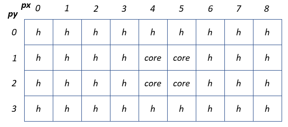

Residual
========

This example shows a CSL program that uses a rectangle of 2-by-2 PEs to compute
``|b - A * x|``, i.e., the norm of the residual ``b - A * x``.

``A`` is an ``M x N`` matrix. Each PE computes a part of the ``A'*x``
multiplication, where ``A''' is a ``M/2 x N/2`` matrix. In other words, each PE
essentially does "a fourth" of the multiplication. It then does a row reduction,
so that the last column of PEs has the result ``b - A*x``. Finally, the PEs of
the last column computes the norm, ``|b-A*x|``, via a column reduction.

The 2-by-2 rectangle is surrounded by memcpy infrastructure which occupies five
column of PEs shown below.
The memcpy routes the input and output data between the host and the device.

.. _fig-residual-memcpy-2-by-2:

The matrix ``A``, the input vectors ``x``  and ``b`` and the output scalar (the
computed norm ``|b - A * x|``) are supported by memcpy streaming.

- The matrix ``A`` is distributed into the PEs.
  For simplicity, the matrix dimensions ``M x N`` are assumed even.

- The vector ``x`` is distributed into the first row PEs.
  The first row receives ``x`` from the memcpy, then
  broadcasts ``x`` into other rows. The incoming vector ``x`` is distributed
  across all N = 4 PEs along the top side of the rectangle.

- The vector ``b`` is distributed into rows of the first column.
  The vector ``b`` is distributed across all M = 6 PEs
  along the left side of the rectangle.

- The scalar ``nrm_r`` is sent out by the PE with coordinates ``pe_x=1`` and
  ``pe_y=0``.

Three functions ``GEMV``, ``AXPY``, and ``NRMINF`` are defined separately, and
are loaded by ``import_module``.  ``GEM`` computes ``y = A*x``, ``AXPY``
computes ``y = alpha*x`` and ``NRMINF`` computes the norm. ``SIMD`` operations
are used in ``GEMV`` and ``AXPY`` to reduce the overhead of address computation.
