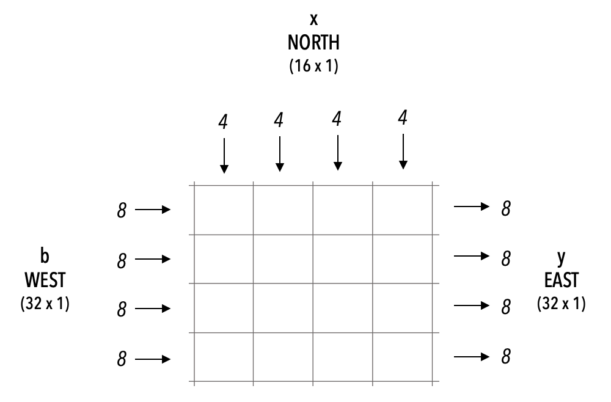

.. _gemv-4-x-4:

GEMV
====

This example shows a CSL program that performs generalized matrix-vector (GEMV) multiplication operation of the form:

.. code-block:: text

    y = Ax + b

where:

- ``A`` is a matrix of shape ``[M, N]`` (stored distributed on PE memory).
- ``x`` is a vector input of shape ``[N, 1]`` (streamed in).
- ``b`` is a vector input of shape ``[M, 1]`` (streamed in).
- ``y`` is the vector output of shape ``[M, 1]`` (streamed out).

In this example, M = 32, N = 16 and we use a PE-rectangle (kernel) of
size 4x4.

Below is a visualization of the kernel interface:

.. _gemv-4-by-4:

Note that this algorithm and the implementation is not optimized for performance. It is intended to serve as a non-trivial introductory example.

All computations are done in FP16 format.

The algorithm uses tiling. For simplicity, we choose M as a multiple of the height of the kernel and N as a multiple of the width of the kernel.

The matrix A, of shape [M, N], is distributed across the PE memories as follows:

- The first dimension of A, M rows, is distributed across the height of the kernel.
- The second dimension of A, N columns, is distributed across the width of
the kernel.

The following memory map specifies how the matrix A is distributed across the PE memories:

Since we know that M is 32 and the height of the kernel is 4, each PE will be assigned 32/4 = 8 rows of A.

Similarly, each PE will get 16/4 = 4 columns of A. This means each PE is assigned a 8x4 chunk of the original matrix A.
